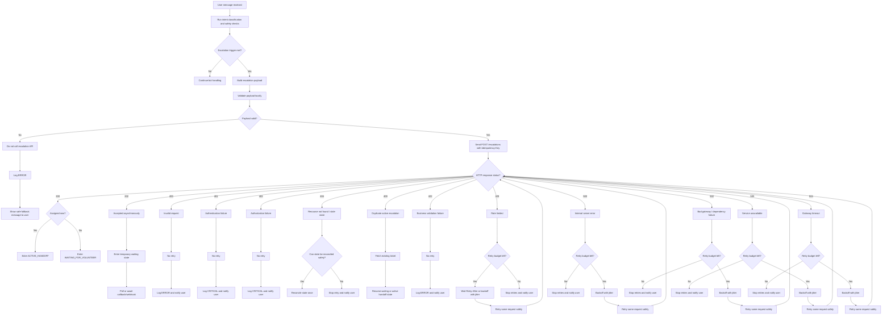

# Week 6 Task Submission — Chanakya Alluri

## Task
**Escalation Flow Technical Implementation Layer**

This submission extends the Week 5 **Bot-to-Human Escalation Flow** by adding implementation-level engineering details required for backend integration, system resiliency, and operational handling.

## Week 6 Deliverables Covered
- Updated Week 5 escalation flow with **specific HTTP status codes**
- **Error-code matrix** mapping:
  - error scenario → HTTP status code
  - error scenario → user-facing message
  - error scenario → internal logging level
- **Retry policy documentation** for each error class
- **Decision tree diagram** for **human escalation vs automatic retry**

## Working Assumptions
- Team 4A bot/orchestrator calls Team 4B escalation endpoints through **backend-to-backend bearer authentication**.
- Team 4A owns escalation triggering, retry behavior, state updates, and user-facing fallback messages.
- Team 4B escalation service owns ticket creation, queueing, volunteer assignment, and volunteer-side resolution metadata.
- Exact endpoint naming remains a working assumption until the final integration contract is frozen.
- Retry behavior must avoid duplicate ticket creation; therefore, idempotency and deduplication are treated as core requirements.

---

# 1) Updated Escalation Flow With HTTP Status Codes

## 1.1 Primary Endpoint Contract

### Request
**Endpoint:** `POST /escalations`

**Headers:**
- `Authorization: Bearer <shared_service_token>`
- `Content-Type: application/json`
- `Idempotency-Key: <unique_request_id>`
- `X-Correlation-ID: <trace_id>`

### Response Format
```json
{
  "success": true,
  "ticket_id": "ESC-10452",
  "queue_status": "queued",
  "assigned_volunteer": null,
  "next_state": "WAITING_FOR_VOLUNTEER",
  "message_for_user": "I’m connecting you to a human volunteer now.",
  "estimated_wait_seconds": 180,
  "priority": "high",
  "errors": []
}
```

---

## 1.2 Success and Error Status Code Semantics

### A. Successful Escalation Outcomes

#### `200 OK`
Used when the escalation request is valid and processed successfully.

Typical outcomes:
- ticket created and queued
- ticket created and immediately assigned
- idempotent replay returns an already-created ticket safely

Examples:
- `queue_status = queued`
- `queue_status = assigned`

#### `202 Accepted`
Used when the request is accepted for asynchronous processing but queue/ticket finalization is not yet complete.

Use when:
- ticket creation is deferred
- queue placement depends on downstream service completion
- orchestrator should poll or wait for webhook/event confirmation

---

### B. Client / Request Errors

#### `400 Bad Request`
Used when the payload is malformed or required fields are missing.

Examples:
- missing `conversation_id`
- missing `session_id`
- missing `latest_user_message`
- both `user_id` and `phone` absent
- invalid enum value for `escalation_reason`
- timestamp not in valid ISO-8601 format

#### `401 Unauthorized`
Used when the bearer token is missing, expired, malformed, or invalid.

Examples:
- no `Authorization` header
- wrong shared service token
- expired token in future contract version

#### `403 Forbidden`
Used when the caller is authenticated but not allowed to use the endpoint.

Examples:
- service identity is valid but not whitelisted for escalation creation
- environment mismatch such as staging caller hitting production-only endpoint

#### `404 Not Found`
Used when a dependent escalation resource or follow-up resource does not exist.

Examples:
- polling a non-existent ticket
- attempting to update or fetch a ticket that has been purged or never created

#### `409 Conflict`
Used when the request conflicts with existing state.

Examples:
- duplicate escalation already active for same session
- session already in `ACTIVE_HANDOFF`
- transition attempted from invalid state

#### `422 Unprocessable Entity`
Used when the JSON is syntactically valid, but business validation fails.

Examples:
- escalation requested although trigger threshold not met and no override present
- transcript summary too long or empty after normalization
- unsupported channel value

#### `429 Too Many Requests`
Used when the escalation service or gateway rate limit is hit.

Examples:
- bot sends too many escalation attempts in a short window
- noisy session repeatedly retries without backoff

---

### C. Server / Dependency Errors

#### `500 Internal Server Error`
Used when the escalation API encounters an unexpected internal failure.

Examples:
- unhandled exception
- serialization failure
- database write crash with no more specific mapping

#### `502 Bad Gateway`
Used when a downstream dependency returns an invalid upstream response.

Examples:
- volunteer router returns malformed data
- queue service responds with unreadable payload

#### `503 Service Unavailable`
Used when the escalation service or critical dependency is temporarily unavailable.

Examples:
- ticket service down
- queue service unavailable
- dependency maintenance window

#### `504 Gateway Timeout`
Used when a downstream dependency times out.

Examples:
- volunteer assignment service timeout
- queue placement timeout
- notification service timeout during synchronous flow

---

## 1.3 Recommended State-to-Status Handling

| Flow Stage | Condition | HTTP Status | Bot Action |
|---|---|---:|---|
| Escalation create | Ticket created and queued | 200 | Enter `WAITING_FOR_VOLUNTEER` |
| Escalation create | Ticket created and assigned | 200 | Enter `ACTIVE_HANDOFF` |
| Escalation create | Accepted for async queueing | 202 | Temporary waiting state + poll/webhook |
| Escalation create | Missing or malformed fields | 400 | Do not retry automatically |
| Escalation create | Invalid token | 401 | Do not retry until auth fixed |
| Escalation create | Authenticated but blocked | 403 | Do not retry automatically |
| Escalation create | Duplicate active escalation | 409 | Reconcile state, do not create new ticket |
| Escalation create | Rate limit hit | 429 | Retry with backoff |
| Escalation create | Internal server failure | 500 | Retry with capped backoff |
| Escalation create | Dependency malformed response | 502 | Retry with capped backoff |
| Escalation create | Service unavailable | 503 | Retry with capped backoff |
| Escalation create | Dependency timeout | 504 | Retry with capped backoff |

---

# 3) Retry Policies

## 3.1 Retry Principles

1. **Never retry blindly for client-side errors** such as `400`, `401`, `403`, or `422`.
2. **Retry only transient failures** such as `429`, `500`, `502`, `503`, and `504`.
3. Use **exponential backoff with jitter**.
4. Use an **Idempotency-Key** to prevent duplicate ticket creation.
5. Retry budget must be capped; after the cap is reached, switch to user-safe fallback messaging.
6. If a ticket may already have been created, **query/reconcile existing state before creating another ticket**.

---

## 3.2 Recommended Retry Matrix

| Status Code | Retry Policy | Max Attempts | Backoff Strategy | Bot Behavior |
|---|---|---:|---|---|
| 400 | No retry | 0 | None | Fail fast, log validation issue |
| 401 | No retry | 0 | None | Fail fast, alert internal team/config |
| 403 | No retry | 0 | None | Fail fast, security log |
| 404 | Usually no retry | 0-1 | Reconcile only | Check whether resource ID is stale |
| 409 | No create retry | 0 | None | Fetch existing ticket and continue |
| 422 | No retry | 0 | None | Treat as business validation failure |
| 429 | Yes | 3 | Honor `Retry-After`, else 2s, 5s, 10s + jitter | Keep user in informed waiting state |
| 500 | Yes | 3 | 2s, 5s, 10s + jitter | Retry safely with same idempotency key |
| 502 | Yes | 3 | 2s, 5s, 10s + jitter | Retry safely |
| 503 | Yes | 4 | 3s, 6s, 12s, 20s + jitter | Retry while informing user |
| 504 | Yes | 3 | 2s, 5s, 10s + jitter | Retry safely |

---

## 3.3 Automatic Retry Decision Rules

### Retry Automatically
Retry automatically when **all** are true:
- failure is transient (`429`, `500`, `502`, `503`, `504`)
- retry budget not exhausted
- the request is idempotent
- no evidence exists that a ticket was already irreversibly created and confirmed

### Do Not Retry Automatically
Do not retry automatically when **any** are true:
- request is invalid (`400`, `422`)
- auth/configuration is broken (`401`, `403`)
- duplicate escalation already exists (`409`)
- state is inconsistent and needs reconciliation before another create call

---

## 3.4 Post-Retry Fallback Behavior

If retries are exhausted:
- stop automatic create attempts
- keep the conversation safe and non-silent
- send a user-facing fallback message such as:
  - “I’m sorry — I couldn’t connect you to a human right now. Please try again shortly.”
- log the final attempt outcome at `ERROR`
- preserve correlation ID, idempotency key, and last known state for debugging

---

# 4) Decision Tree — Escalate to Human vs Retry Automatically



---

# 5) Implementation Notes for Engineers

## 5.1 Idempotency and Duplicate Prevention
To prevent duplicate ticket creation during retries:
- every escalation create request must send an `Idempotency-Key`
- server should bind that key to the first successful ticket result
- retries with the same key should return the same semantic result rather than creating a second ticket

## 5.2 Correlation and Traceability
Every request should include:
- `X-Correlation-ID`
- `session_id`
- `conversation_id`
- `ticket_id` once available

These should appear in logs so engineering teams can reconstruct the escalation path end to end.

## 5.3 Safe User Messaging
User-facing messages should:
- never expose internal status codes
- avoid security details such as auth failures
- acknowledge delay when retrying transient failures
- clearly distinguish waiting state from failure state

## 5.4 Recommended Bot State Transitions
- `200 queued` → `WAITING_FOR_VOLUNTEER`
- `200 assigned` → `ACTIVE_HANDOFF`
- `202 accepted` → temporary `WAITING_FOR_VOLUNTEER_PENDING_CONFIRMATION`
- `409 duplicate` → reconcile and restore either `WAITING_FOR_VOLUNTEER` or `ACTIVE_HANDOFF`
- retry exhausted after transient failure → `ESCALATION_FAILED`

---

# 6) Final Summary

This Week 6 update adds the technical implementation details missing from Week 5 by defining:
- exact HTTP status code behavior
- an operational error-code matrix
- retry logic for transient vs non-transient failures
- a concrete decision tree for **escalate vs retry** behavior

Together, Week 5 + Week 6 now provide both:
1. the **functional escalation design**, and
2. the **engineering response logic** needed for backend implementation.

