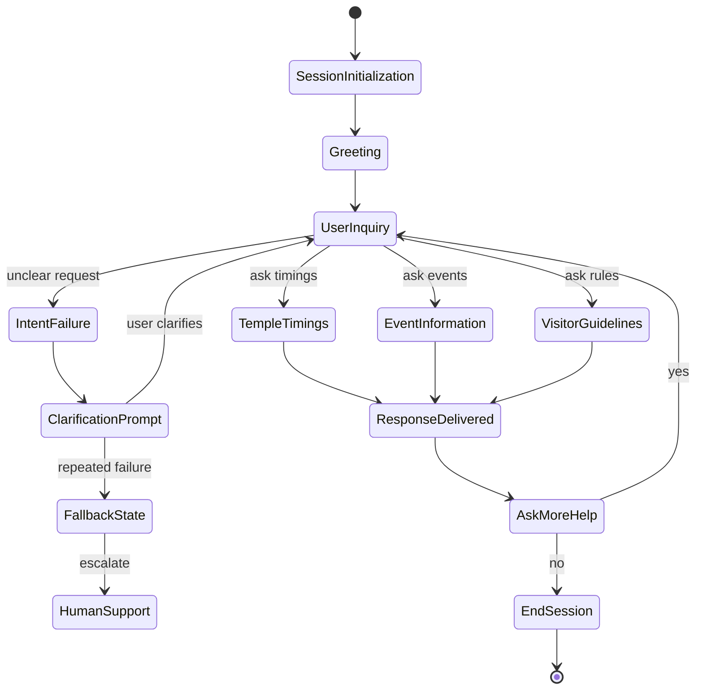
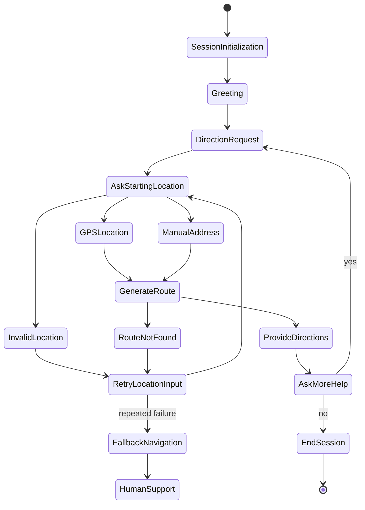
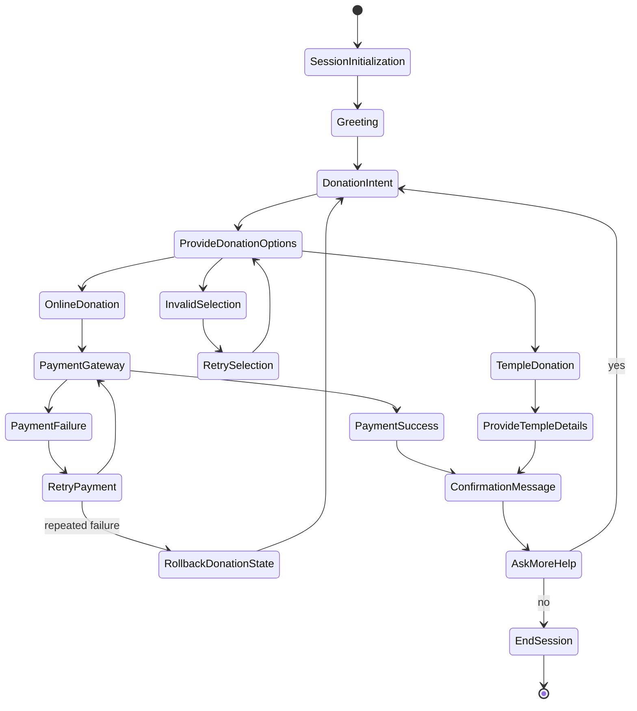
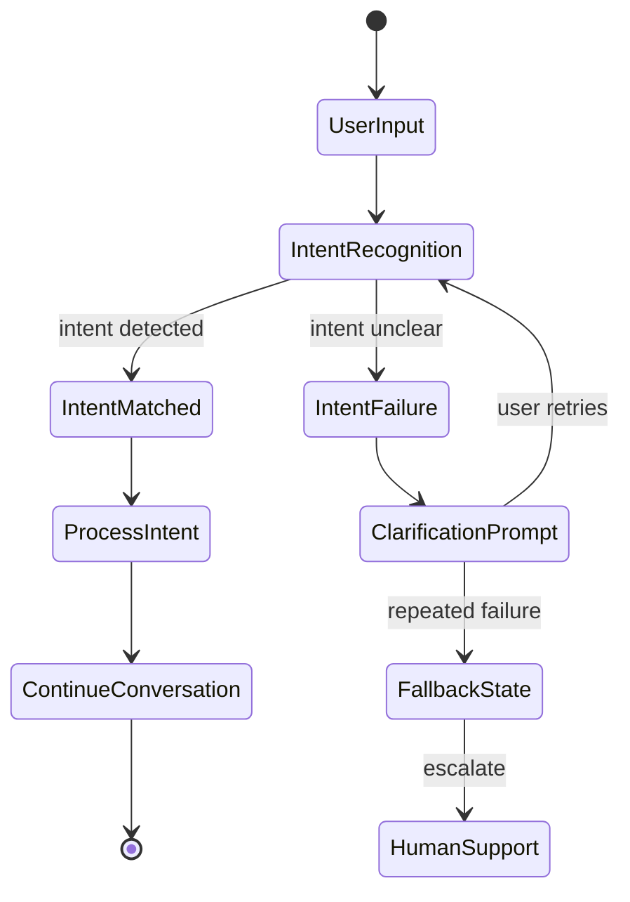
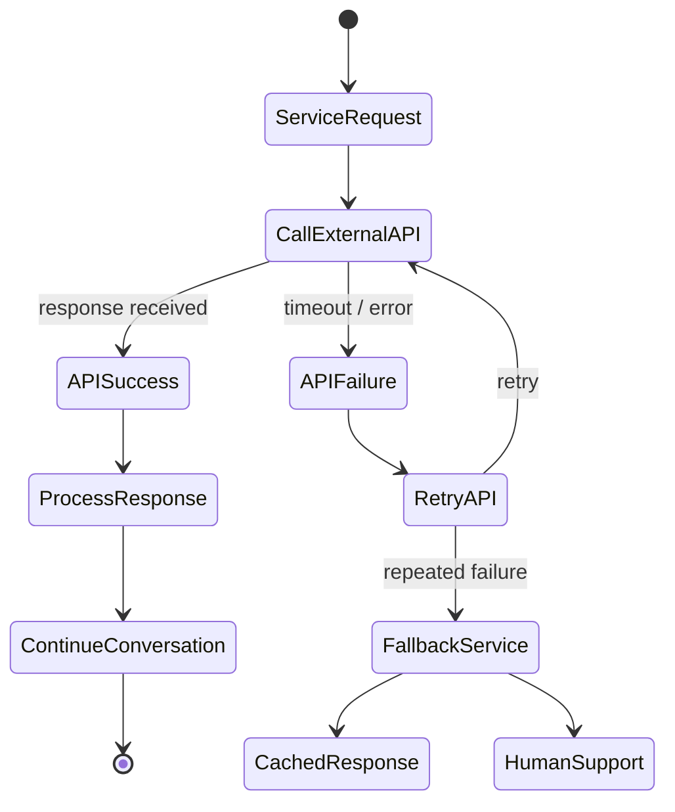

## Visitor Inquiry Flow — Error Handling Added

## Temple Directions Flow — Error Handling Added

## Donation Request Flow — Error Handling Added

## Intent Recognition Error Handling

## External API Failure Handling

