# Event Query Intent Design  
**Rujul Shukla**  

## Overview  
This document outlines event-related user intents, conversation flows, edge cases, and clarification strategies for a conversational event assistant.

---

# 1. Event-Related User Intents (8)

## 1. Time-Based Intent  
**User:** “What events are happening this weekend?”

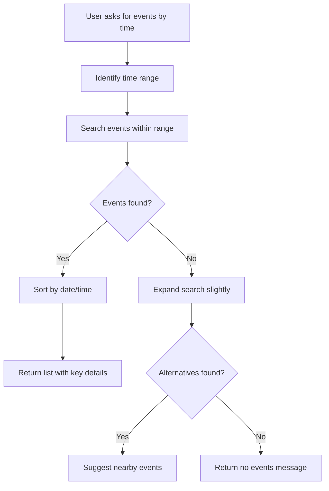

---

## 2. Event-Specific Intent  
**User:** “Tell me about Holi Festival”

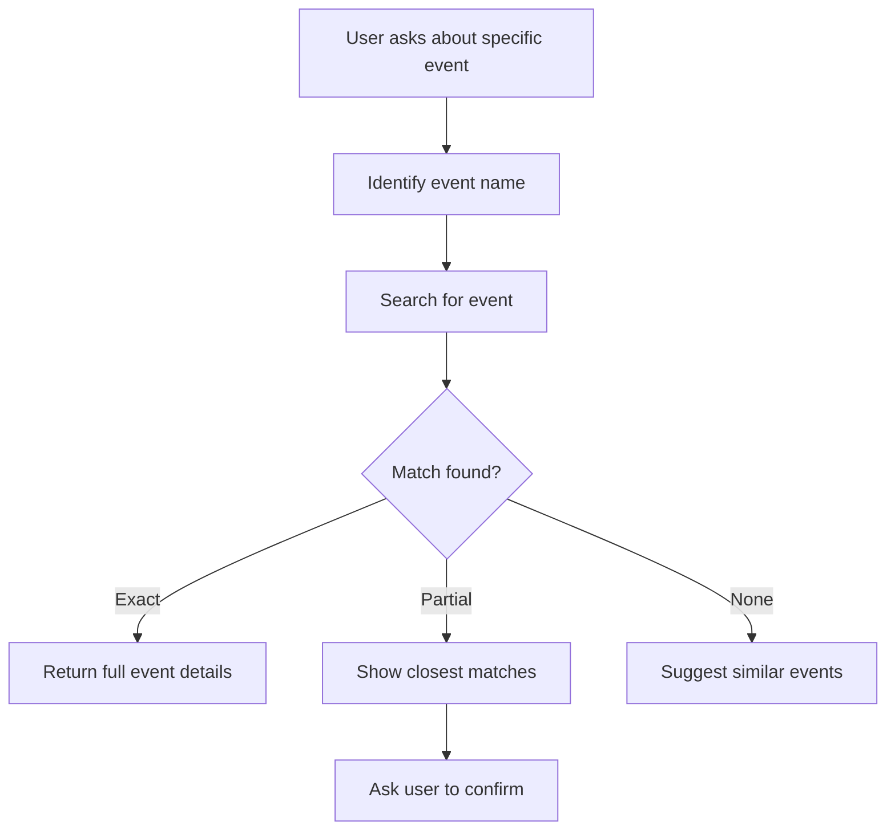

---

## 3. Recurring Schedule Intent  
**User:** “When is yoga class?”

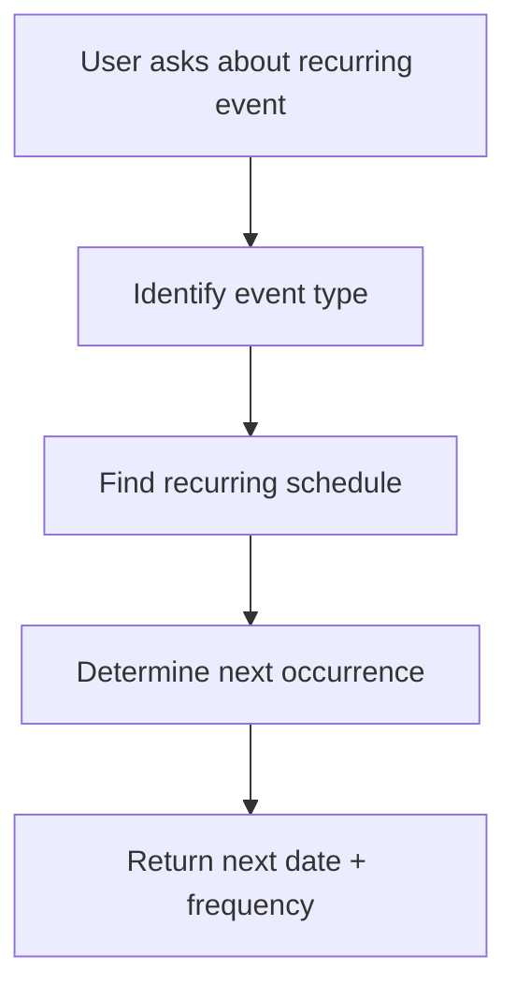

---

## 4. Logistics / Parking Intent  
**User:** “Where do I park for the event?”

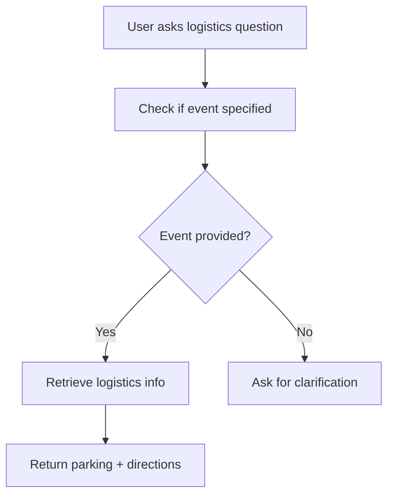

---

## 5. Sponsorship / Donation Intent  
**User:** “How can I sponsor an event?”

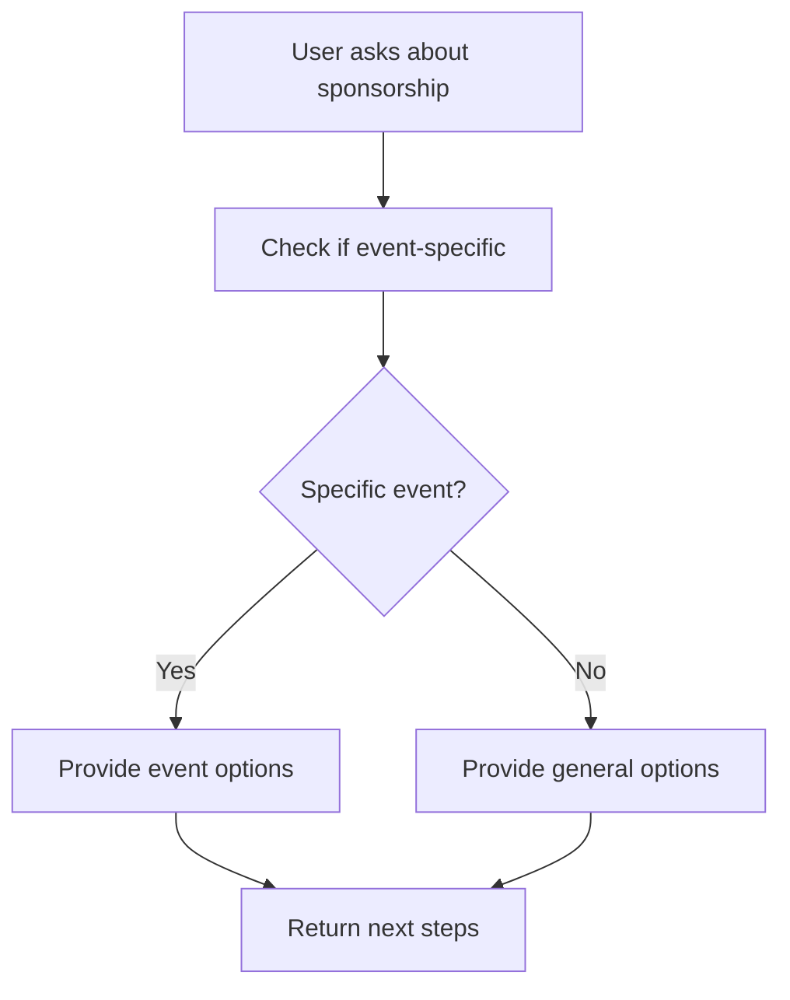

---

## 6. Discovery Intent  
**User:** “What fun events are happening?”

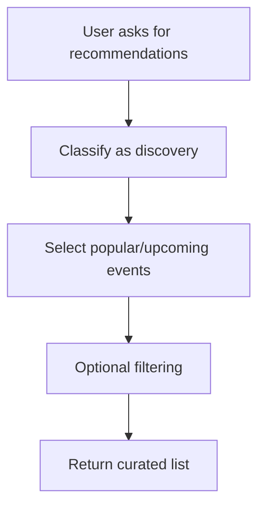

---

## 7. Ambiguous Intent  
**User:** “What’s happening?”

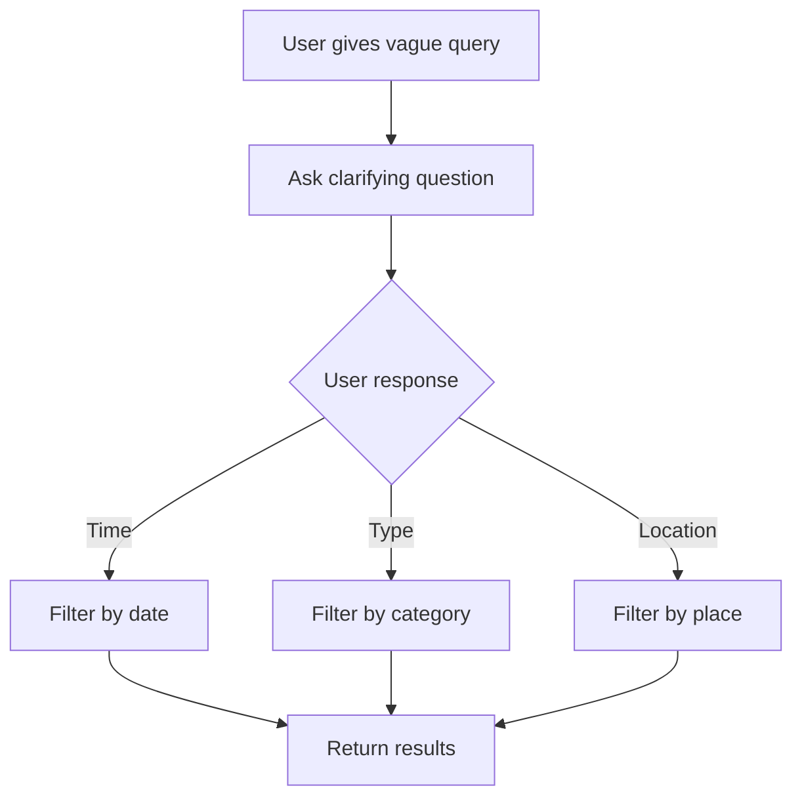

---

## 8. No-Results Intent  
**User:** “Events at 3 AM tonight?”

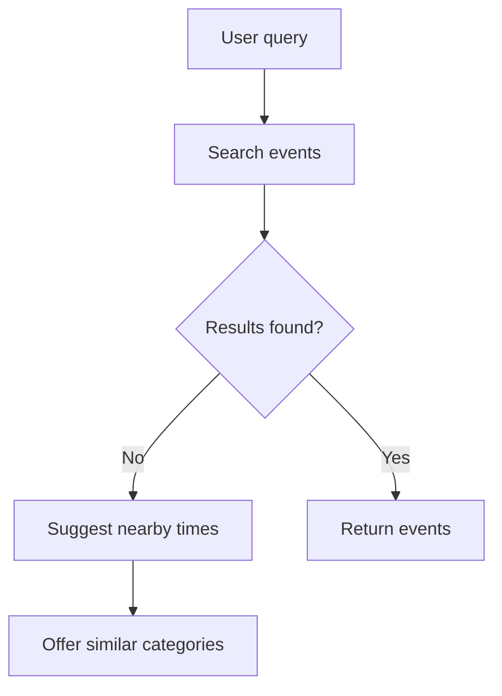

---

# 2. Edge Cases (5)

## 9. Multi-Day Events  
**User:** “What’s happening during the retreat?”

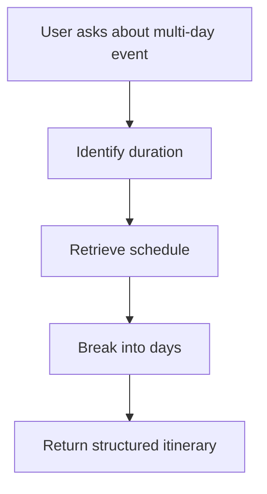

---

## 10. Overlapping Events  
**User:** “What’s happening Friday evening?”

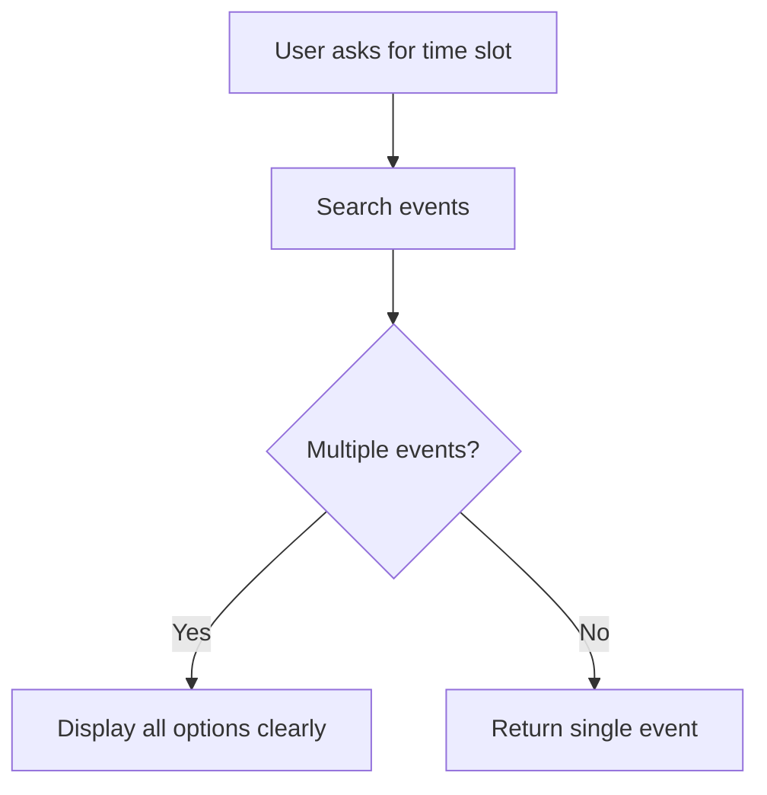

---

## 11. Past Events  
**User:** “What happened last weekend?”

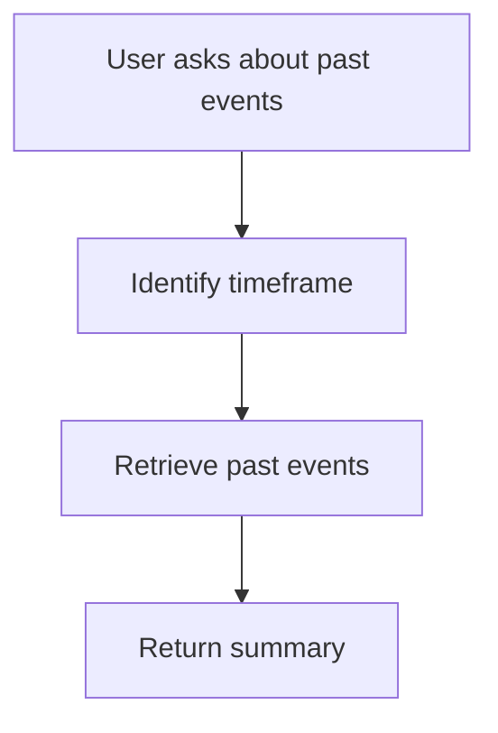

---

## 12. Cross-Source Events  
**User:** “Show events from all platforms”

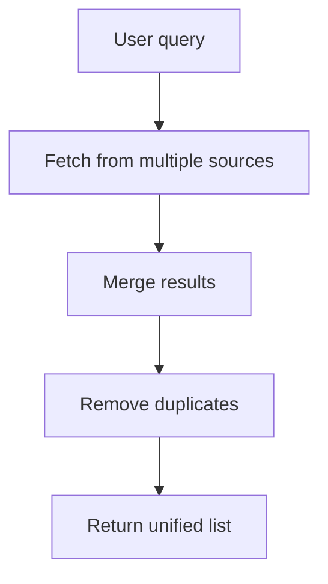

---

## 13. Event Not Found  
**User:** “Is there a Diwali Gala today?”

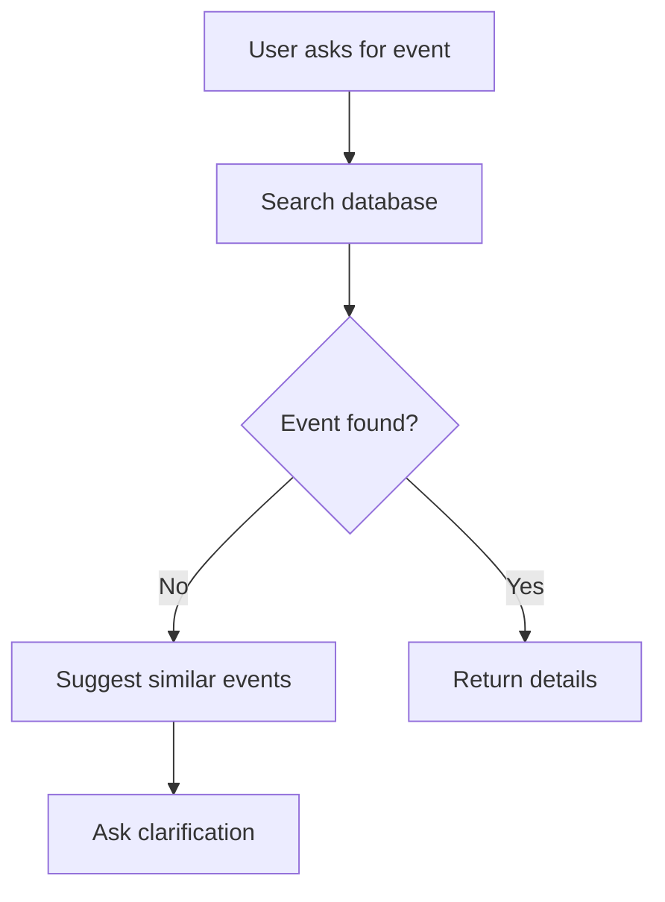

---

# 3. Clarification Flows

## Vague Query Handling  
**User:** “What’s going on?”

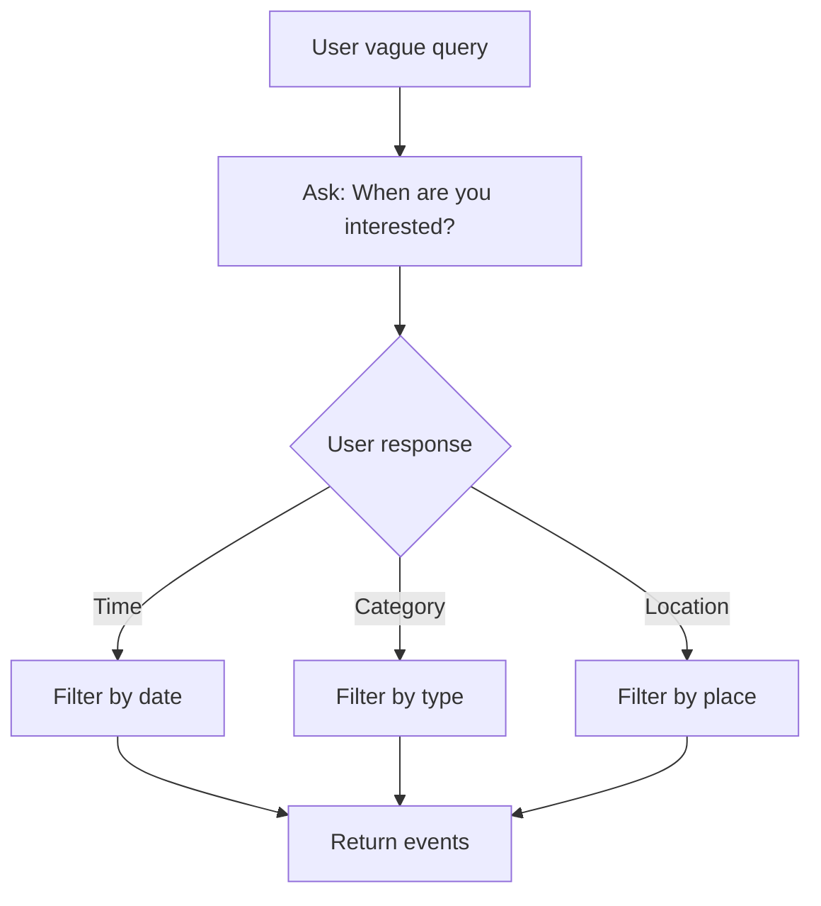

---

## Multi-Step Clarification  
**User:** “Any events?”

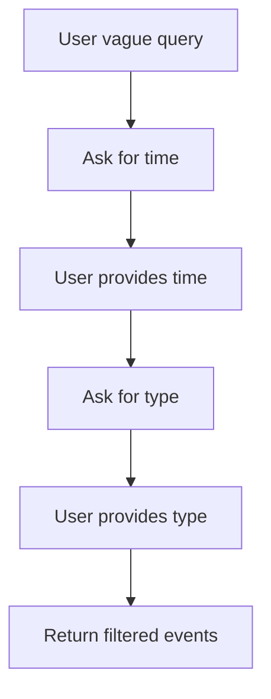

---

# Summary  
This design:
- Covers diverse real-world intents  
- Handles ambiguity and edge cases effectively  
- Keeps flows simple, structured, and implementable  
