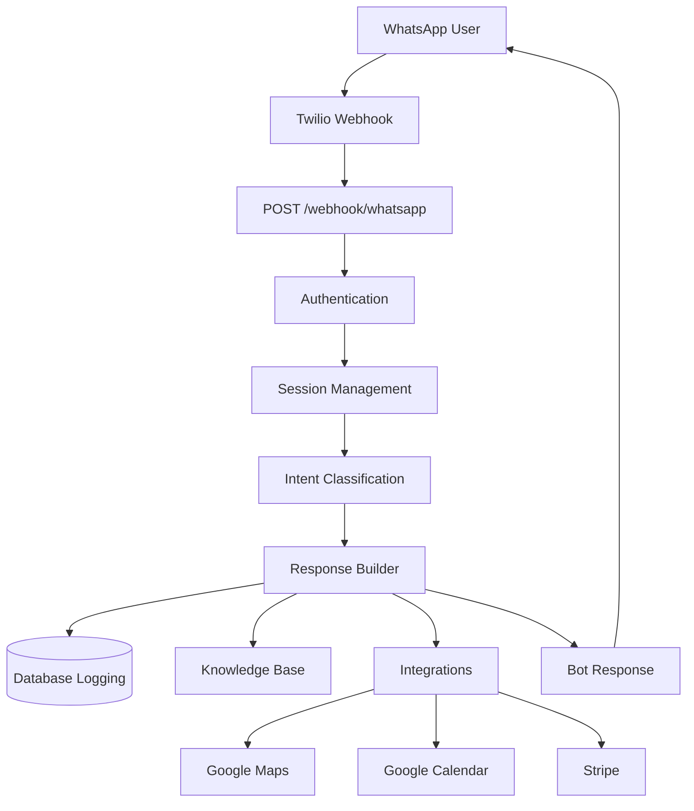

# JKYog WhatsApp Bot

FastAPI-based WhatsApp bot for JKYog Radha Krishna Temple: Twilio webhook, phone auth, session management, Gemini-powered intent and responses, knowledge base (FAQs + events), and integrations (Google Maps, Calendar, Stripe).

---

## How to run the bot

Setup is **not complicated**—no local run, no code changes. With **GitHub**, **Render**, and **Twilio** accounts ready:

1. **Clone the repo** (or have it on GitHub so Render can connect).
2. **Create a Render Web Service** and connect the GitHub repository.
3. **Add a PostgreSQL database** on Render (or use Supabase); add `DATABASE_URL` to the service.
4. **Set environment variables** in the Render Environment tab (see [Environment variables](#environment-variables)).
5. **Deploy**; wait for the build to finish (2–4 min).
6. **Connect Twilio:** In the Twilio WhatsApp sandbox, set the webhook URL to `https://<your-service>.onrender.com/webhook/whatsapp`.
7. **Test:** Send a WhatsApp message to the sandbox number; the bot replies.

End-to-end is **under 10 minutes** including first deploy.

---

## Prerequisites

- **Accounts:** GitHub, Render, Twilio (WhatsApp sandbox)
- **Database:** PostgreSQL (e.g. [Render Postgres](https://render.com/docs/databases) or [Supabase](https://supabase.com))
- **API keys:** Google AI (Gemini) for full bot responses; optional: Google Maps, Stripe Payment Links, Google Calendar

---

## Project structure

```
4B/week4/
├── __init__.py
├── main.py
├── requirements.txt
├── render.yaml
├── alembic.ini
├── .env.example
├── README.md
├── ASSIGNMENT.md
├── authentication/
│   ├── __init__.py
│   ├── auth.py
│   ├── phone_verification.py
│   └── session_manager.py
├── bot/
│   ├── __init__.py
│   ├── entity_extractor.py
│   ├── intent_classifier.py
│   └── response_builder.py
├── database/
│   ├── __init__.py
│   ├── models.py
│   ├── schema.py
│   └── state_tracking.py
├── integrations/
│   ├── __init__.py
│   ├── calendar.py
│   ├── google_maps.py
│   └── stripe.py
├── knowledge_base/
│   ├── __init__.py
│   ├── events.json
│   ├── faqs.json
│   └── ingestion.py
└── migrations/
    ├── env.py
    ├── script.py.mako
    └── versions/
        ├── .gitkeep
        └── 001_initial_schema_users_conversations_messages_session_state.py
```

---

## Architecture overview



Flow: Twilio sends the message to the webhook; the app authenticates by phone, manages session, classifies intent, builds a response using the knowledge base and integrations, logs to the database, and sends the reply back via Twilio.

---

## Environment variables

Set these in the **Render dashboard** (Environment tab) for your Web Service. Required for the bot to run:

| Variable | Required | Description |
|----------|----------|-------------|
| `DATABASE_URL` | Yes | PostgreSQL URL (`postgresql://` or `postgres://`). App will not start without it. |
| `TWILIO_ACCOUNT_SID` | Yes | Twilio account SID (needed to send WhatsApp replies). |
| `TWILIO_AUTH_TOKEN` | Yes | Twilio auth token. |
| `TWILIO_WHATSAPP_FROM` | Yes | Twilio WhatsApp sender, e.g. `whatsapp:+14155238886`. |
| `GOOGLE_API_KEY` | Yes* | Google AI (Gemini) key for intent and responses. Without it, bot uses keyword fallback and hardcoded text. |
| `LOG_LEVEL` | No | Default `INFO`. |
| `GEMINI_MODEL` | No | Default `gemini-2.5-flash`. |
| `GOOGLE_MAPS_API_KEY` | No | For temple directions. |
| `STRIPE_DEFAULT_LINK`, `STRIPE_DALLAS_LINK`, etc. | No | Stripe donation links. |
| `GOOGLE_CALENDAR_SERVICE_ACCOUNT_JSON`, `GOOGLE_CALENDAR_ID` | No | For calendar events. |

Reference: `4B/week4/.env.example` lists all variables. In Render you only need to add the required ones (and any optional) in the Environment tab.

---

## Deploy to Render (step-by-step)

1. **Push the repository to GitHub** (or use an existing fork).
2. In [Render](https://render.com), create a new **Web Service** and connect the GitHub repo.
3. **Root Directory:** leave blank (repo root).
4. **Build command:** `pip install --upgrade pip && pip install -r 4B/week4/requirements.txt`
5. **Start command:** `uvicorn 4B.week4.main:app --host 0.0.0.0 --port $PORT`
6. **Database:** Create a **PostgreSQL** instance on Render (or use Supabase). In your Web Service → **Environment**, add `DATABASE_URL` (Render Postgres: use the **Internal Database URL**).
7. **Environment:** Add the rest of the required variables: `TWILIO_ACCOUNT_SID`, `TWILIO_AUTH_TOKEN`, `TWILIO_WHATSAPP_FROM`, `GOOGLE_API_KEY`. Add any optional vars if you use them.
8. **Deploy.** Wait for the build to finish.
9. **Twilio:** In the Twilio WhatsApp sandbox, set the webhook URL to `https://<your-service>.onrender.com/webhook/whatsapp`.
10. **Test:** Send a WhatsApp message to the sandbox number; the bot should reply.

If the repo’s `render.yaml` is used, Render may pre-fill build/start; you still must add all environment variables in the dashboard (never commit secrets).

---

## API endpoints

- **GET /** — Confirms the bot is running.
- **GET /health** — Health check; returns `{"status":"ok"}`.
- **POST /webhook/whatsapp** — Main WhatsApp webhook (Twilio sends messages here).

---

## WhatsApp webhook flow

1. Twilio sends a form-encoded POST to `/webhook/whatsapp` with `From`, `Body`, `ProfileName`.
2. The app normalizes the phone number, authenticates the user, and gets or creates a conversation and session.
3. The inbound message is logged; intent is classified and the response is built (knowledge base + integrations).
4. The reply is sent via Twilio, session context is updated, and the outbound message is logged.
5. The API returns JSON with the bot reply and session token.

---

## Integrations

- **Google Maps** — Temple directions from user location.
- **Google Calendar** — Upcoming events; falls back to `knowledge_base/events.json` if the API is unavailable.
- **Stripe** — Pre-configured donation links per location.

---

## Troubleshooting

- **App won’t start:** Check that `DATABASE_URL` is set and is a valid PostgreSQL URL (`postgresql://` or `postgres://`).
- **404 from Gemini / bot replies fail:** Ensure `GOOGLE_API_KEY` is set and valid; see [4B/rohan-kothapalli/logs/week-4/week4-gemini-fix.md](../../rohan-kothapalli/logs/week-4/week4-gemini-fix.md) for model-name issues.
- **WhatsApp not replying:** Verify Twilio env vars and that the Twilio WhatsApp sandbox webhook URL points to `https://<your-service>.onrender.com/webhook/whatsapp`.

---

*Documentation maintained by Leena Hussein (Documentation Lead).*
